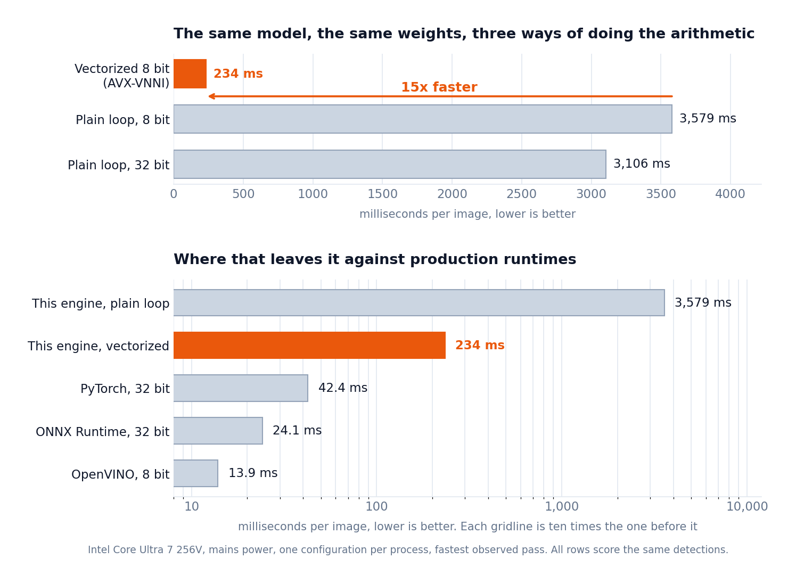

# Custom AI Hardware Inference

A fire and smoke detector that runs on hand written C++ instead of a machine learning library.

The starting point is a YOLOv8n model trained to find fire and smoke in photos. Normally you would run it with PyTorch or ONNX Runtime, which does all the math for you. This project rebuilds that stack from scratch to understand what those libraries are actually doing. First it shrinks the model so it uses 8 bit whole numbers instead of 32 bit decimals, with the conversion math written from first principles rather than by calling a library function. Then it implements the engine that runs the model, including the convolutions, the activation functions, the compound blocks YOLOv8 is built from, the detection head, box decoding and duplicate removal.

Give it a photo and it draws boxes around the fire and smoke it finds.

```bash
./custom_engine fire.jpg      # writes fire_pred.jpg
```

```
Kernel: vnni-int8
Loaded fire.jpg (608x608)
Inference: 257.6 ms
Detections: 1
  fire   0.733  box=[328.4, 179.6, 528.3, 581.4]
```

| | |
|---|---|
|  |  |

Red for fire, blue for smoke, with the class and confidence drawn on the box. Both of these came out of the engine as shown, no post processing.

## Milestones

**M1, full precision baseline.** Trained YOLOv8n on the fire-8 dataset, 3.0M parameters over two classes, 50 epochs on a Tesla T4. Benchmarked across four production runtimes to establish what the model does and how fast the alternatives are.

**M2, 8 bit quantization written from scratch.** Rather than calling `torch.quantization`, this implements the underlying math directly.

- Converting weights to 8 bit, both per-tensor and per-channel
- Measuring the range of every activation in the network by running calibration images through it and recording what actually flows through each layer
- Folding BatchNorm into the convolution so it costs nothing at runtime
- Integer accumulation with the requantization arithmetic that converts back to real values

**M3, the C++ engine.** Loads the quantized model and runs it end to end.

- A tensor type that carries its own scale and offset, so operations cannot silently combine numbers that mean different things
- A loader for a custom binary and JSON model format
- Quantized convolution with 32 bit accumulation and folded BatchNorm
- A vectorized version of that convolution built on the processor's 8 bit dot product instruction, fifteen times faster than the plain loop and byte for byte identical in what it produces
- Activation functions, upscaling, pooling and feature map merging
- The compound blocks YOLOv8 is built from, Bottleneck, C2f and SPPF
- The detection head, including the distribution based box decoding and removal of overlapping boxes
- JPEG in, annotated JPEG out

**M4, hardware accelerator.** An FPGA implementation in Verilog. Planned.

## Results

The engine keeps **99.6% of the original model's accuracy**. The metric is mAP@0.5, a standard detection score where higher is better and 1.0 is perfect. Every row was produced by the same scoring code over the same 49 test images, so they compare directly.

| Configuration | mAP@0.5 | vs full precision |
|---|---|---|
| Original 32 bit model | 0.8859 | reference |
| **This engine, per-channel weights** | **0.8826** | **99.6%** |
| This engine, per-tensor weights | 0.7680 | 86.7% |

Per-channel weights are what close most of the gap. Per-tensor gives a whole layer one shared scale, while per-channel gives each output channel its own. Since the filters within a layer can differ in magnitude by more than a factor of ten, a shared scale is set by the loudest filter and forces the quietest ones into a handful of the 256 available steps. Per-channel costs four bytes per output channel of metadata and nothing at runtime, because the multiplier that converts the accumulator back to real values is already per-channel.

For reference, the same model converted to 8 bit by production libraries scores 0.8556 with ONNX Runtime and 0.8089 with OpenVINO.

The vectorized kernel described below scores exactly the same 0.8826, because it produces byte for byte identical output. Speed work on this engine cannot quietly cost accuracy without the comparison catching it.

## Speed

The engine runs three convolution kernels, picked with `--kernel`. They compute the same thing and differ only in how the arithmetic is issued.

<picture>
  <source media="(prefers-color-scheme: dark)" srcset="docs/speedup-dark.png">
  
</picture>

| Kernel | What it does | Best latency | mAP@0.5 |
|---|---|---|---|
| `scalar-fp32` | the plain loop in 32 bit decimals | 3106 ms | 0.8836 |
| `scalar-int8` | the plain loop in 8 bit integers | 3579 ms | 0.8826 |
| `vnni-int8` | 8 bit integers, 32 multiplies per instruction | **234 ms** | 0.8826 |

The 32 bit row is a timing baseline rather than a full precision model. It runs the same 8 bit weights converted back to decimals and still passes 8 bit values between layers, so it measures what the arithmetic costs and nothing else. A genuinely full precision engine would score 0.8859.

The middle row is the surprising one. Going from 32 bit decimals to 8 bit integers made the engine about 15 percent **slower**. That is not a bug, and it is the whole reason the third row exists.

Small numbers are not faster to multiply. A one byte multiply and a four byte multiply both take roughly a cycle. What 8 bit actually buys is room, because the same register holds four times as many of them. A plain loop handles one number at a time and never uses that room, while the 8 bit version does a little more bookkeeping per multiply, so it ends up behind.

The third row uses the room. Processors have an instruction, VPDPBUSD, that multiplies 32 pairs of 8 bit numbers and adds all the results together in one go. It was sitting in the chip the whole time. Reaching it took two changes, and neither was about precision.

The first was memory order. The instruction wants its 32 numbers side by side. The engine stored feature maps one channel at a time, so the values it needed to multiply together sat a whole feature map apart. They now get copied into the right order before each convolution, which costs a fraction of a percent of the work being done.

The second was sign. The instruction expects one side to be unsigned, so every stored value is shifted by 128 and the offset that goes with it shifts to match. This is the same reason production tools store activations unsigned and weights signed.

Fifteen times faster, and byte for byte identical. Every layer output matches the plain loop exactly, and so does every detection across all 49 test images, because it is the same integer arithmetic done 32 at a time instead of one at a time.

### Against the libraries

Each runtime is paired against its own 32 bit measurement, which is the only way to attribute a change to precision rather than to a change of runtime.

| Runtime | 32 bit | 8 bit | Effect of 8 bit |
|---|---|---|---|
| ONNX Runtime | 24.1 ms | 30.8 ms | 1.28x slower |
| OpenVINO | 28.5 ms | 13.9 ms | 2.05x faster |
| This engine, plain loop | 3106 ms | 3579 ms | 1.15x slower |
| This engine, vectorized | 3106 ms | 234 ms | 13.3x faster |

Only OpenVINO gained from 8 bit on its own, because it converts the activations too and merges the convolution, the bias and the activation function into single vectorized steps. ONNX Runtime lost time here because only the convolutions were converted, so the model changes number format between almost every layer, and those conversions cost more than the faster convolutions save. That same narrow scope is what protects its accuracy.

OpenVINO is still about 17 times faster than the vectorized engine. Most of that is threading, since it uses all eight cores and the engine uses one. The rest is cache blocking and merging the activation function into the convolution.

All CPU measurements were taken on mains power, one configuration per process with a settle gap between them, reporting the fastest observed pass. Sharing a process between runtimes inflated the numbers by an order of magnitude before that was corrected.

## What is actually 8 bit

Worth stating precisely, since the phrase can mean different things.

The weights are 8 bit, stored and loaded as raw bytes and never converted to floating point. The activations passed between every layer are 8 bit. The convolution is a genuine integer multiply accumulate into a 32 bit accumulator, which is exactly the operation the processor's 8 bit dot product instruction performs 32 at a time, and the same operation an FPGA would implement later.

The conversion between layers is floating point, and so is the detection head. The head is deliberate. Box coordinates run from 0 to 640 while confidence scores run from 0 to 1, and a single 8 bit scale cannot represent both, so decoding stays in full precision.

## What is next

Writing CUDA GEMM kernels to make the engine fast on a GPU.

The vectorization above was the first half of that work. Reaching the 8 bit instruction meant laying the data out so the numbers being multiplied together sit next to each other, and that is the same layout a matrix multiply wants. What is left is restructuring the convolution as a proper matrix multiply, then writing the GPU kernels for it.

The model needs 4.04 billion multiply accumulates per image. The plain loop got through 1.1 billion of them per second. The vectorized one manages 17.3 billion per second. Threading it across the other seven cores is the obvious next gain on the CPU, and a GPU should move it by a larger factor again.

Accuracy is protected while that happens. Layer by layer comparison against PyTorch plus end to end scoring over the test set means any kernel that breaks correctness shows up immediately rather than several stages later. The vectorized kernel was the first real test of that, and it came out byte for byte identical.

## Reproducing

```bash
python quantization/calibrate.py                    # measure activation ranges
python quantization/save_model.py --per-channel     # write the quantized model
cd cpp_engine && mkdir -p build && cd build && cmake .. && make

python quantization/compare_layers.py --dumps cpp_engine/build/dumps_pc \
    --model quantization/model_int8_pc.json         # layer by layer check
bash cpp_engine/run_both.sh
python quantization/eval_map.py --csv cpp_engine/build/preds_pc/detections.csv
python benchmarks/run_all_benchmarks.py             # compare against the libraries
python docs/make_speedup_chart.py                   # redraw the charts above

cd cpp_engine/build
./custom_engine ../../fire.jpg                      # vectorized, the default
./custom_engine ../../fire.jpg --kernel scalar-int8  # the plain 8 bit loop
./custom_engine ../../fire.jpg --kernel scalar-fp32  # the 32 bit baseline
```

Requires `cmake`, a C++17 compiler and `nlohmann-json`. Image handling uses [stb](https://github.com/nothings/stb), included in `cpp_engine/third_party/`.

## Layout

- `quantization/`, the Python side. Conversion math, calibration, BatchNorm folding, and the two validation harnesses.
- `cpp_engine/`, the engine. Tensor type, model loader, operators, detection head, image handling.
- `benchmarks/`, comparisons against PyTorch, ONNX Runtime, OpenVINO and TensorRT.

## Dataset

[fire-8 from Abonia1](https://github.com/Abonia1/YOLOv8-Fire-and-Smoke-Detection), a two class fire and smoke detection dataset. The model is YOLOv8n fine tuned for 50 epochs, 3.0M parameters. Its weights take 12.0 MB as 32 bit decimals and 3.0 MB as 8 bit integers, four times smaller. The checkpoint file on disk is only 6.2 MB because Ultralytics stores it at half precision and converts back to 32 bit when the model is loaded.
