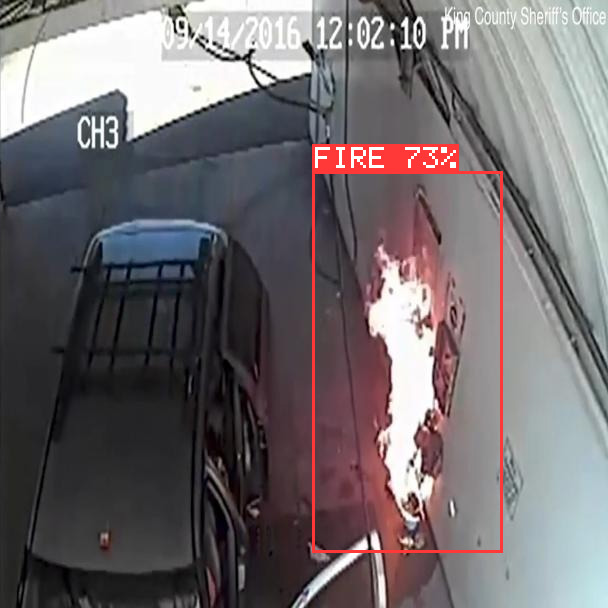
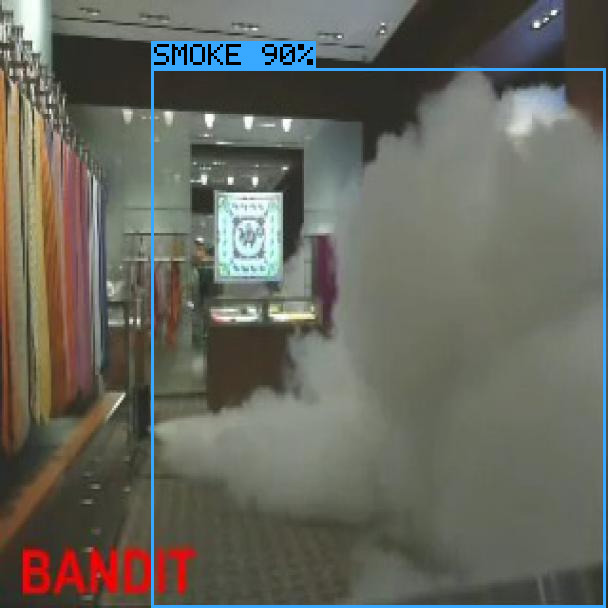

# Custom AI Hardware Inference

A fire and smoke detector that runs on hand written C++ instead of a machine learning library.

The starting point is a YOLOv8n model trained to find fire and smoke in photos. Normally you would run it with PyTorch or ONNX Runtime, which does all the math for you. This project rebuilds that stack from scratch to understand what those libraries are actually doing. First it shrinks the model so it uses 8 bit whole numbers instead of 32 bit decimals, with the conversion math written from first principles rather than by calling a library function. Then it implements the engine that runs the model, including the convolutions, the activation functions, the compound blocks YOLOv8 is built from, the detection head, box decoding and duplicate removal.

Give it a photo and it draws boxes around the fire and smoke it finds.

```bash
./custom_engine fire.jpg      # writes fire_pred.jpg
```

```
Loaded fire.jpg (640x640)
Inference: 3516.4 ms
Detections: 1
  fire   0.733  box=[328.4, 179.6, 528.3, 581.4]
```

| | |
|---|---|
|  |  |

Red for fire, blue for smoke, with the class and confidence drawn on the box. Both of these came out of the engine as shown, no post processing.

## Milestones

**M1, full precision baseline.** Trained YOLOv8n on the fire-8 dataset, 3.0M parameters over two classes, 50 epochs on a Tesla T4. Benchmarked across four production runtimes to establish what the model does and how fast the alternatives are.

**M2, 8 bit quantization written from scratch.** Rather than calling `torch.quantization`, this implements the underlying math directly.

- Converting weights to 8 bit, both per-tensor and per-channel
- Measuring the range of every activation in the network by running calibration images through it and recording what actually flows through each layer
- Folding BatchNorm into the convolution so it costs nothing at runtime
- Integer accumulation with the requantization arithmetic that converts back to real values

**M3, the C++ engine.** Loads the quantized model and runs it end to end.

- A tensor type that carries its own scale and offset, so operations cannot silently combine numbers that mean different things
- A loader for a custom binary and JSON model format
- Quantized convolution with 32 bit accumulation and folded BatchNorm
- Activation functions, upscaling, pooling and feature map merging
- The compound blocks YOLOv8 is built from, Bottleneck, C2f and SPPF
- The detection head, including the distribution based box decoding and removal of overlapping boxes
- JPEG in, annotated JPEG out

**M4, hardware accelerator.** An FPGA implementation in Verilog. Planned.

## Results

The engine keeps **99.6% of the original model's accuracy**. The metric is mAP@0.5, a standard detection score where higher is better and 1.0 is perfect. Every row was produced by the same scoring code over the same 49 test images, so they compare directly.

| Configuration | mAP@0.5 | vs full precision |
|---|---|---|
| Original 32 bit model | 0.8859 | reference |
| **This engine, per-channel weights** | **0.8826** | **99.6%** |
| This engine, per-tensor weights | 0.7680 | 86.7% |

Per-channel weights are what close most of the gap. Per-tensor gives a whole layer one shared scale, while per-channel gives each output channel its own. Since the filters within a layer can differ in magnitude by more than a factor of ten, a shared scale is set by the loudest filter and forces the quietest ones into a handful of the 256 available steps. Per-channel costs four bytes per output channel of metadata and nothing at runtime, because the multiplier that converts the accumulator back to real values is already per-channel.

For reference, the same model converted to 8 bit by production libraries scores 0.8556 with ONNX Runtime and 0.8089 with OpenVINO.

## Speed

The honest weak point and the current focus. The engine was written for correctness first, with no vectorization, no threading and no cache blocking.

| Runtime | Precision | Best latency |
|---|---|---|
| PyTorch, laptop CPU | FP32 | 42.4 ms |
| ONNX Runtime, laptop CPU | FP32 | 24.1 ms |
| OpenVINO, laptop CPU | INT8 | 13.9 ms |
| TensorRT, Tesla T4 | INT8 | 4.9 ms |
| This engine, laptop CPU | INT8 | 3516 ms |

All CPU measurements were taken in one session on mains power, one runtime per process with a settle gap between them, reporting the fastest of 120 samples. Sharing a process between runtimes inflated the numbers by an order of magnitude before that was corrected.

## What is actually 8 bit

Worth stating precisely, since the phrase can mean different things.

The weights are 8 bit, stored and loaded as raw bytes and never converted to floating point. The activations passed between every layer are 8 bit. The convolution is a genuine integer multiply accumulate into a 32 bit accumulator, which is the operation that maps onto a single SIMD instruction and onto hardware later.

The conversion between layers is floating point, and so is the detection head. The head is deliberate. Box coordinates run from 0 to 640 while confidence scores run from 0 to 1, and a single 8 bit scale cannot represent both, so decoding stays in full precision.

## What is next

Writing CUDA GEMM kernels to make the engine fast on a GPU.

The current engine is a correctness first implementation, six nested loops with no vectorization, no threading and no cache blocking. It gets through 1.15 billion multiply accumulates per second against the 4.04 billion the model needs per image. The plan is to restructure the convolution as a matrix multiply and write the kernels for it, which is how real engines get their speed.

Accuracy is protected while that happens. Layer by layer comparison against PyTorch plus end to end scoring over the test set means any kernel that breaks correctness shows up immediately rather than several stages later.

## Reproducing

```bash
python quantization/calibrate.py                    # measure activation ranges
python quantization/save_model.py --per-channel     # write the quantized model
cd cpp_engine && mkdir -p build && cd build && cmake .. && make

python quantization/compare_layers.py --dumps cpp_engine/build/dumps_pc \
    --model quantization/model_int8_pc.json         # layer by layer check
bash cpp_engine/run_both.sh
python quantization/eval_map.py --csv cpp_engine/build/preds_pc/detections.csv
python benchmarks/run_all_benchmarks.py             # compare against the libraries
```

Requires `cmake`, a C++17 compiler and `nlohmann-json`. Image handling uses [stb](https://github.com/nothings/stb), included in `cpp_engine/third_party/`.

## Layout

- `quantization/`, the Python side. Conversion math, calibration, BatchNorm folding, and the two validation harnesses.
- `cpp_engine/`, the engine. Tensor type, model loader, operators, detection head, image handling.
- `benchmarks/`, comparisons against PyTorch, ONNX Runtime, OpenVINO and TensorRT.

## Dataset

[fire-8 from Abonia1](https://github.com/Abonia1/YOLOv8-Fire-and-Smoke-Detection), a two class fire and smoke detection dataset. The model is YOLOv8n fine tuned for 50 epochs, 3.0M parameters. Its weights take 12.0 MB as 32 bit decimals and 3.0 MB as 8 bit integers, four times smaller.
